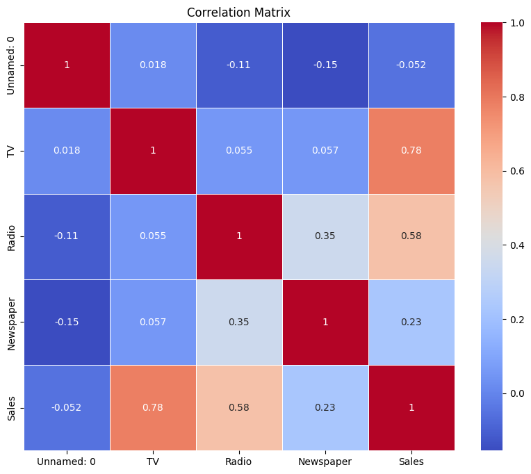

# Sales Prediction using Python 📈💰

This project is part of my **Data Science Internship** at **@CodeAlpha**. The goal was to build a machine learning model that predicts future sales based on advertising expenditure in TV, Radio, and Newspaper.

## 📌 Project Overview
* **Student ID:** CA/DF1/22584
* **Internship Domain:** Data Science
* **Project Name:** Sales Prediction
* **Organization:** CodeAlpha

## 📂 Dataset
The dataset used for this analysis contains advertising budgets for three media channels and the corresponding sales figures:
* **TV:** Advertising budget for TV.
* **Radio:** Advertising budget for Radio.
* **Newspaper:** Advertising budget for Newspaper.
* **Sales:** The target variable (Total Sales).

## 🛠️ Technologies Used
* **Python** (Programming Language)
* **Pandas** (Data Manipulation)
* **Matplotlib & Seaborn** (Data Visualization)
* **Scikit-Learn** (Machine Learning Library)
* **Linear Regression** (Predictive Model)
* **Google Colab / Jupyter Notebook** (IDE)

## 🚀 Key Features
1.  **Data Preprocessing:** Cleaned the data and checked for missing values.
2.  **Exploratory Data Analysis (EDA):** Used Correlation Heatmaps and Pairplots to identify that **TV advertising** has the strongest impact on Sales.
3.  **Model Training:** Built a **Linear Regression** model to predict sales based on ad spend.
4.  **Model Evaluation:** Achieved high accuracy, demonstrating a clear linear relationship between marketing budget and revenue.
5.  **Visualization:** Plotted "Actual vs Predicted" sales to visually confirm the model's performance.

## 📊 Results
The model successfully identifies the relationship between advertising spend and sales.
* **TV Advertising:** Highly correlated with Sales.
* **Radio:** Moderate correlation.
* **Newspaper:** Low correlation.

### 📷 Actual vs Predicted Sales
The scatter plot below shows how close the model's predictions (blue dots) are to the actual sales figures (red line).

## 🤝 Acknowledgement
Thanks to **@CodeAlpha** for providing this opportunity to apply Data Science techniques to business problems.

---
**Author:** Sunit Modak
**LinkedIn:** [https://www.linkedin.com/in/sunit-modak-6064403a5/](https://www.linkedin.com/in/sunitmodak/)
